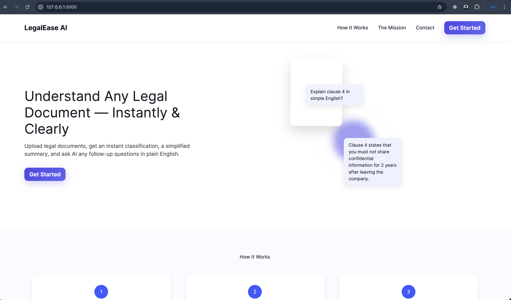
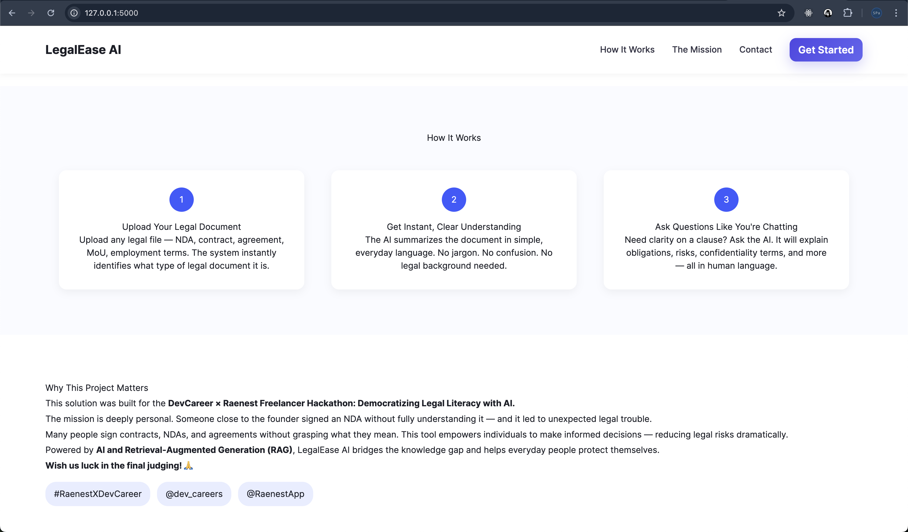
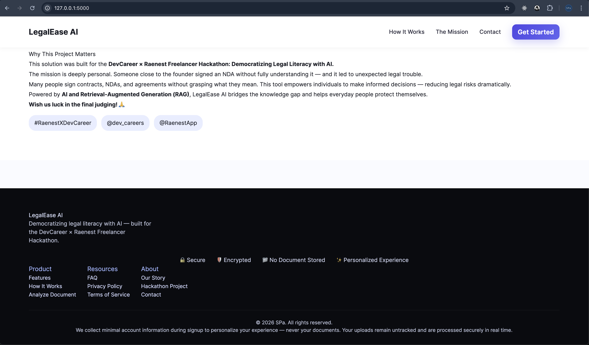
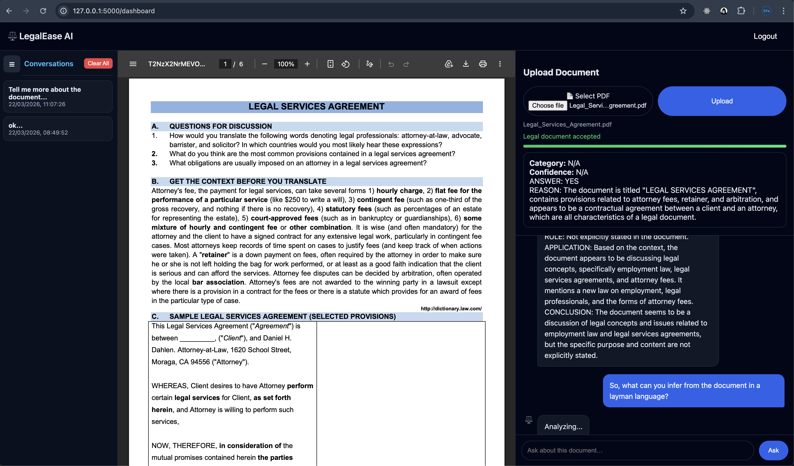
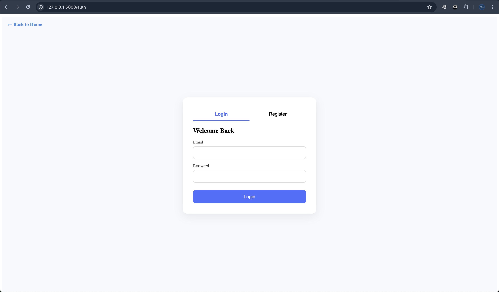
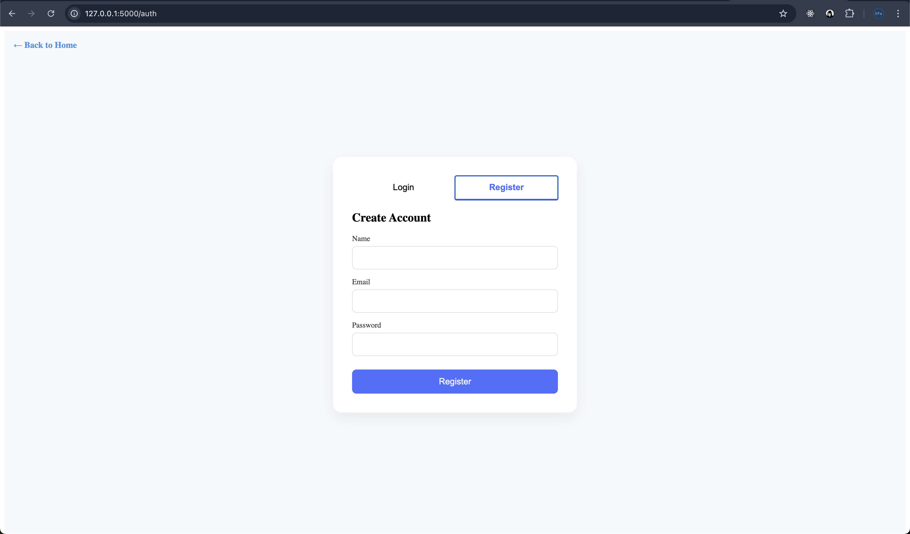
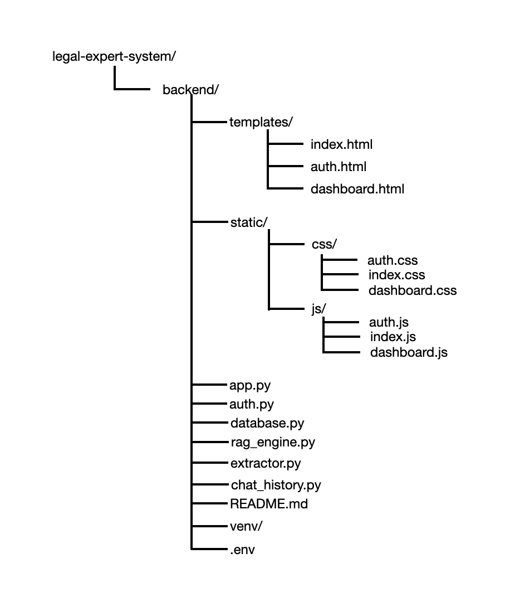

# 🏛️ DevCareer x Raenest Freelancer Hackathon  
## **Democratizing Legal Literacy with AI – An AI-Powered Legal Document Understanding Tool (LegalEase AI)**

---

## 🌟 Introduction

The problem is deeply personal and painfully common.  

In recent months, a simple NDA (Non-Disclosure Agreement) led someone close to me into unexpected legal trouble. They signed it without fully understanding the terms, and soon they were stuck with obligations they couldn't navigate. 😟  

This experience revealed a widespread issue:  
**People sign legal documents—contracts, NDAs, employment terms—without truly understanding them.**  

To address this challenge, I built an AI-powered tool for the **DevCareer x Raenest Freelancer Hackathon** that **democratizes access to legal understanding using Retrieval-Augmented Generation (RAG)**.  

This system empowers anyone—freelancers, job seekers, small business owners, and everyday people—to understand legal documents clearly, confidently, and instantly. ⚖️🤖  

---

# 🧠 What the System Does

The platform uses **advanced RAG (Retrieval-Augmented Generation)** with **LLaMA 3 + Nomic Embeddings** to read, classify, summarize, and explain legal documents.

### 🚀 Core Features

### **1️⃣ Upload Any Legal Document**
Upload PDFs, DOCX, or text-based legal files.





### **2️⃣ Automatic Legal Document Classification**
The system identifies document type (NDA, Contract, Employment Agreement, etc.) using embeddings + RAG reasoning.

### **3️⃣ Plain-Language Explanation**
A clear, easy-to-understand summary is provided so users can truly grasp the meaning.

### **4️⃣ Ask Follow-Up Questions (Chatbot UI)**
Users can ask:
- “What are my obligations?”
- “Can this be enforced?”
- “What happens if I break this clause?”



### **5️⃣ Session-Based Authentication**
Built with secure Flask session cookies (HTTPOnly, SameSite=Strict).





---

# 💼 Target Users

- Freelancers  
- Startup founders  
- Employees reviewing contracts  
- Anyone asked to sign NDAs, agreements, or policies  
- People without legal backgrounds  

This tool empowers people to make informed decisions and avoid costly mistakes. 💡

---

# ⚙️ How It Works (Pipeline)

The system follows a clean, efficient AI pipeline:

### **UPLOAD → EXTRACT → RAG-BASED LEGAL FILTER → INDEX → ASK → TRACK HISTORY**

#### **1. Extract Text**
Uses universal PDF/DOCX extraction.

#### **2. Validate Legal Document**
RAG-powered classifier checks whether the uploaded document is legal in nature.

#### **3. Build RAG Index**
- Splits document into chunks  
- Embeds using **Nomic Embed**  
- Indexed in **LlamaIndex VectorStoreIndex**

#### **4. Ask Questions**
The user chats with an AI agent using IRAC-style legal reasoning.

#### **5. Save Conversations**
Users can revisit past chats (stored in SQLite).

---

# 🗂️ Project Structure



---

# 🔧 Tech Stack

### **Backend**
- Python 3.11  
- Flask (authentication, routing, session cookies)  
- SQLite (secure persistent conversation history)

### **AI**
- LLaMA 3 (Ollama)  
- Nomic Embed Text  
- LlamaIndex (VectorStoreIndex + Query Engine)  
- RAG pipeline with IRAC-style legal reasoning

### **Frontend**
- HTML, CSS, JavaScript  
- Responsive UI  
- Smooth chat-style Q&A interface  

---

# 🛠️ Installation & Setup

### **1. Clone Repository**
```bash
git clone <repo-url>
cd legal-expert-system
```

### **2. Install Dependencies**
```bash
pip install -r requirements.txt
```

### **3. Start Ollama**
```bash
ollama serve
```

### **4. Pull Models**
```bash
ollama pull llama3
ollama pull nomic-embed-text
```

### **5. Start Flask Server**
```bash 
cd backend
python app.py
```

### Output in the terminal: Server runs at
`http://localhost:5000

## 🔐 Authentication Flow
- Users can register and create accounts
- Sessions persist using secure cookies
- Unauthorized users cannot:
  - Upload files
  - Ask questions
  - View dashboard

## 🧩 Key Modules

rag_engine.py 
Handles:
- Text chunking
- Embedding
- Index building
- RAG querying
- Legal document classification

extractor.py
Extracts text from PDF/DOCX securely.

auth.py
User login, register, logout.

chat_history.py
Conversation tracking + storage.

## 🚀 Why This Project Matters

Legal literacy is not a privilege—it's a necessity.
But most people:
- cannot afford lawyers,
- do not understand legal language,
- and are afraid of signing complex agreements.
This tool changes that.
It gives everyone the power to understand what they’re signing.

No more blind trust.
No more confusion.
No more legal traps.

This is AI used for empowerment. 

## 🤝 Acknowledgements

Built for:
DevCareer x Raenest Freelancer Hackathon

Tags:
- #RaenestXDevCareer
- #DevCareer
- #RaenestApp
- #LegalTech
- #AIForGood


## 🙏 Closing Note

I’m incredibly proud to share this project.
It solves a real problem—one that affected someone close to me.
And now it can help thousands more.

Wish me luck in the final judging! 🙌

# 👤 Author

**Sunday P. Afolabi**

---

## 🌐 Connect With Me

- 🐦 Twitter / X: https://x.com/SundayPeterAfo1  
- 💼 LinkedIn: https://www.linkedin.com/in/sunday-p-afolabi/ 
- 🧑‍💻 GitHub: https://github.com/Lecon-a  
- 📧 Email: spait2025@gmail.com  

---

## 🚀 About Me

I’m passionate about building AI-powered solutions that solve real-world problems.  
This project reflects my commitment to **using technology to make legal knowledge accessible to everyone**, especially those without a legal background.

---

## 💬 Feedback & Collaboration

If you find this project useful or would like to collaborate:

👉 Feel free to reach out via any of the platforms above.  
I’m open to feedback, partnerships, and opportunities.

---

